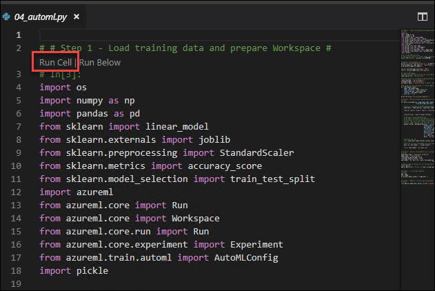
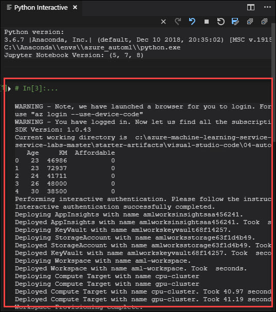
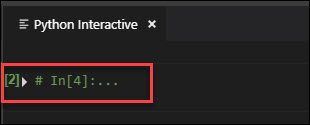
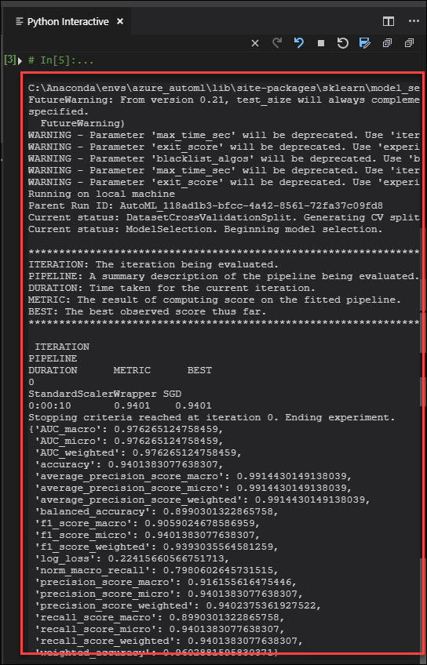
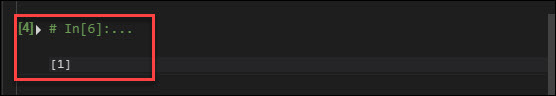
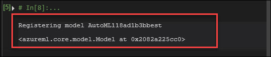

# Lab 4 - Model Training with AutoML

In this lab you will us the automated machine learning (Auto ML) capabilities within the Azure Machine Learning service to automatically train multiple models with varying algorithms and hyperparameters, select the best performing model and register that model.

## Exercise 0 - Get the lab files
If you have not cloned this repository to your local machine, do so now. All of the artifacts for this lab are located under `C:\labfiles\azure-machine-learning-service-labs-master\starter-artifacts\visual-studio-code`.

## Exercise 1 - Get oriented to the lab files
1. On your local computer expand the folder `C:\labfiles\azure-machine-learning-service-labs-master\starter-artifacts\visual-studio-code`. 
2. Expand the `data` folder. This folder contains the CSV file `UsedCars_Affordability.csv` which contains the complete data set with labels (Affordable is 1 for affordable, 0 for not affordable). 
    
3. To run a lab, start Visual Studio Code and open the folder: `04-automl` and click the starting python file: `04_automl.py`. 
4. Confirm that your have setup `azure_automl` as your interpreter. 
     
     
5. `04_automl.py` is the Python file you will step thru executing in this lab. 
6. For each step click on `Run Cell` just above the step. 
    

## Exercise 2 - Train a model using AutoML
This lab builds upon the lessons learned in the previous lab, but is self contained so you work thru this lab without having to run a previous lab.  
1. Begin with **Step 1**. In this step you are loading the data prepared in previous labs and acquiring (or creating) an instance of your Azure Machine Learning Workspace. In this step, be sure to set the values for `subscription_id`, `resource_group`, `workspace_name` and `workspace_region` as directed by the comments. **Execute** step 1. 
    
    
2. To train a model using **AutoML** you need only provide a configuration for AutoML that defines items such as the type of model (classification or regression), the performance metric to optimize, exit criteria in terms of max training time and iterations and desired performance, any algorithms that should not be used, and the path into which to output the results. This configuration is specified using the `AutomMLConfig` class, which is then used to drive the submission of an experiment via `experiment.submit`.  When AutoML finishes the parent run, you can easily get the best performing run and model from the returned run object by using `run.get_output()`. **Execute** Step 2 to define the helper function that wraps the AutoML job submission. 
    
3. In **Step 3**, you invoke the AutoML job. **Execute** Step 3. 
    
4. Try out the best model by using Step 4. 
    

## Exercise 3 - Register an AutoML created model
1. You can register models created by **AutoML** with Azure Machine Learning just as you would any other model. **Execute** Step 5 to register this model. 
    
